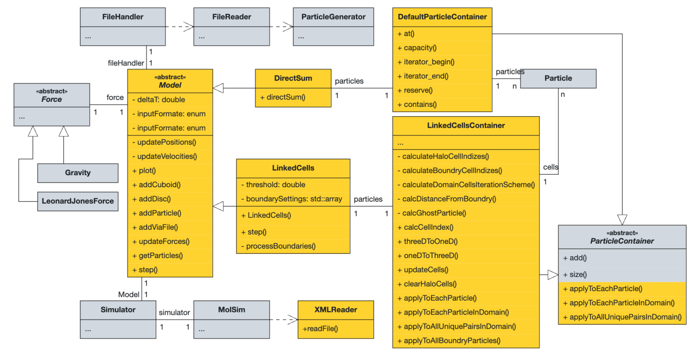
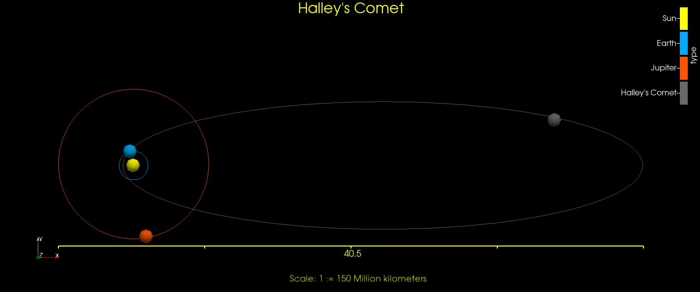
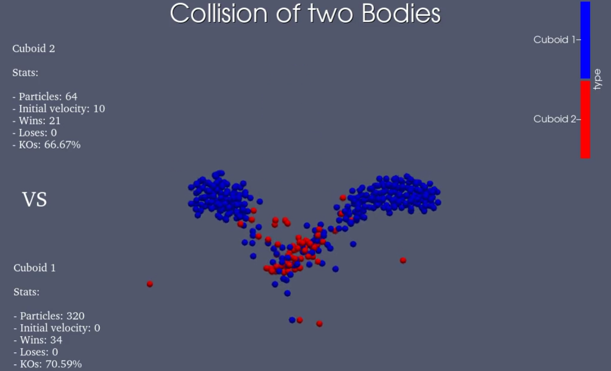
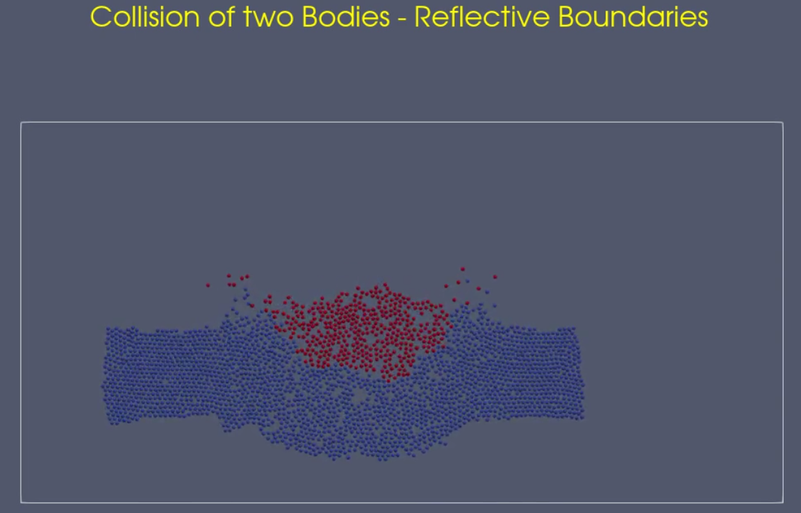
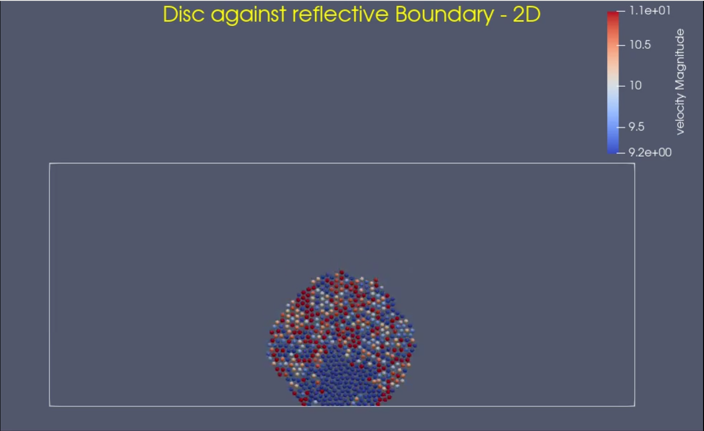

# Molecular Dynamics — Group A

This repository is for the practical course **PSE: Molecular Dynamics** for group A in the SS 2024 semester.

---

## Repository Status

CMake Multi-Platform: (Currently only tested on Ubuntu)

[](https://github.com/AshIsAtWork/MolSim/actions/workflows/cmake-multi-platform.yml)

Tests:

[](https://github.com/AshIsAtWork/MolSim/actions/workflows/unit-tests.yml)

Doxygen Documentation:

[](https://github.com/AshIsAtWork/MolSim/actions/workflows/doxygen.yml)

The hosted Documentation can be found [here](https://ashisatwork.github.io/MolSim/).

---

## All Contributors

### Group Members

- [Ashutosh Solanki](https://github.com/AshIsAtWork)
- [Daniel Schade](https://github.com/D4ni3lSch4d3)
- [Robin Cleve](https://github.com/cleveee)

### Course Supervisors

- [Manish Mishra](https://github.com/manishmishra6016)
- [Markus Mühlhäußer](https://github.com/thesamriel)
- [Fabio Gratl](https://github.com/FG-TUM)

---

## About The Project

This is the practical project repository for the course offered by the Scientific Computing Chair at TUM.

### Current Project Structure



---

### Built Using:

- Clang 16.0.6
- CMake 3.27.4
- make 4.3
- Boost Program Options 1.74.0.3

### Dependencies

You will need the following to compile the program:

- Doxygen 1.10.0 (Only needed for generating documentation)

  ```bash
  sudo apt install doxygen
  ```

- Graphviz 2.42.2 (Only needed for generating documentation)

  ```bash
  sudo apt install graphviz
  ```

- Libxerces 3.2.4

  ```bash
  sudo apt install libxerces-c-dev
  ```

- Boost Program Options 1.74.0.3

  ```bash
  sudo apt-get install libboost-program-options-dev
  ```

---

## Build

The process of building the project is described here:

1. Create and change your working directory to the build folder inside the project.

   ```bash
   mkdir build && cd build
   ```

2. Configure the Program using Cmake.

   - Standard:

     ```bash
     cmake ..
     ```

   - With Doxygen Documentation:

     ```bash
     cmake .. -D BUILD_DOCS=ON
     ```

3. Building the Program

   - Compile Project:

     ```bash
     make
     ```

   - Compile Docs using Doxygen

     ```bash
     make doc_doxygen
     ```

     Note: Output present inside **build/docs/html/index.html** <br><br>

4. Running the Program   

   - Inside your **build/** folder run the following command:

     ```bash
     ./MolSim -f <FILENAME> -i <INPUTFORMAT> -o <OUTPUTFORMAT>
     ```

   - Here, we included a list enumerating all bigger simulation tasks appeared in the last sprints: <br><br>

     - **Sprint 1 — Halley's Comet**
     
       
       
        ```bash
        ./MolSim -f ../input/assignment-1/eingabe-sonne.txt --force gravity -e 1000 -d 0.014 -i txt -o vtk
        ```

     - **Sprint 2 — 2D collision of two bodies**
        
        

       ```bash
       ./MolSim -f ../input/assignment-2/2D-cuboid-collision.txt -e 5 -d 0.0002 --force ljf -i txt -o vtk
       ```
       
     - **Sprint 3 — 2D collision of two bodies revisited** 
        
        
    
       ```bash
       ./MolSim -f ../input/assignment-3/2D-cuboid-collision.xml -i xml -o vtk
       ```
     - **Sprint 3 — Disc flying against a reflective boundary**
        
            
    
       ```bash
       ./MolSim -f ../input/assignment-3/disc-against-wall.xml -i xml -o vtk 
       ```

5. Running all Tests

   - First: Change into your **build/** folder:

     - Using ctest:

       ```bash
       ctest
       ```

     - Using executable:

       ```bash
       ./MolSimTests
       ```
