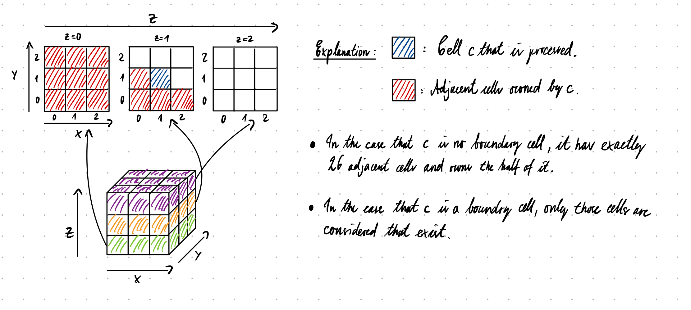

# Group A #
Members:
- [Daniel Schade](https://github.com/D4ni3lSch4d3)
- [Ashutosh Solanki](https://github.com/AshIsAtWork)
- [Robin Cleve](https://github.com/cleveee)

# Code #
* Link to Pull Request: [Pull Request for Assignment 3](TODO!!!)
* Compiler: gcc 11.4.0

# Report #

---

## Task 1: XML Input ##
Todo @Ashutosh

## Task 2: Linked-cell Algorithm ##

**1. Introduction**     
Note: If you are already familiar with the theory behind the linked-cell algorithm, you may skip the introduction.   

In the last weeks, we experienced long execution times of our simulation even for a relatively small number of particles. To be able to simulate scenarios containing
more molecules in an acceptable amount of time, the need of coming up with a new algorithm is unavoidable. The model called `Direct Sum` we have been using in the last weeks calculated for each time step the force between all unique pairs of particles. Because the number of unique pairs of particles is in the order of `O(n²)`, whereby `n` is the number of particles, the running time increases approximately by a factor of `4` if we double the number of particles `n` resulting in unacceptable long execution times for a large number of particles.    
Therefore, the only possibility to speed up the algorithm is to only process a subset of all pairs. Here comes the `Linked Cell` algorithm into play belonging to the so-called short range algorithms. It only considers pairs of particles that distance is below some threshold called cut-off radius `r`. The cut-off radius depends on the force used for the simulation, and should be chosen in a way that the force between the particles that to each-other distance exceed the cut-off radius is negligibly small.   
The last problem we have to overcome is the distance calculation being still in the order of `O(n²)`. The linked-cell algorithm solves this problem by dividing the simulation domain into evenly sized cells in such a way that the distance of a particle `p` within a certain cell to another particle `q` can be only smaller than the threshold `r`, if `q` belongs to the same cell as `p` or a cell that is a direct neighbor of this cell.   
By making this simplification, we can decrease the number of calculations per time step to the order of `O(n)` resulting in significantly better execution times, especially for large `n`, which we will show later by comparing the running times of two models for different numbers of particles. 

**2. Our implementation of the linked-cell algorithm**   

**Creating a new particle container and introducing a new inheritance hierarchy**   
As a first step, we implemented a new particle container called [LinkedCellsContainer](../../src/particleRepresentation/container/LinkedCellsContainer.h) and refactored the old one for the direct sum implementation and gave it the new name [DefaultParticleContainer](../../src/particleRepresentation/container/DefaultParticleContainer.h). Both particle containers extend the abstract base class [ParticleContainer](../../src/particleRepresentation/container/ParticleContainer.h) that provides the possibilities of adding particles to the container and various means of iterating over particles and pairs of particles within the container. The big advantage of this approach is that we can use the same in- and output methods for each explicit container type without the need to provide multiple implementations. That guarantees a good code legibility and avoids code duplication.   

**Basic setup of the linked-cells container**   
As part of the implementation of the linked-cells algorithm there are multiple problems to solve:   
* **Division of the domain into cells**: The requirement that has to be fulfilled is that all particles having a smaller distance than the cut-off radius `r` to some particle `p` belonging to some cell `c` should be part of cell `c` or of some cell being a direct neighbor off cell `c`. This guarantees that all particles within the cut-off radius are considered by only processing cell `c` and its neighbor cells. To achieve this, the size of a cell in each dimension should be at least `r`. This can be realized by setting the size of each cell in dimension `d` to `size_d = domainSize_d / N_d`, where `N_d` is the number of cells in dimension `d`. The number of cells in dimension `d` is set to `N_d =  ⌊domainSize_d / r⌋`, where `r` is the cut-off radius. This leads to cell sizes being larger than the optimal cell size `r`, if the domain size in dimension `d` cannot be divided by `r`. Another point to consider was, where to locate the simulation domain in the coordinate system, because only its size was given, but not its location. We decided to define the front lower left point of the simulation domain as `(0,0,0)` being a good choice for further calculations.
   
* **Data structure**: As suggested in the lecture slides, we flattened the 2/3-dimensional cell structure and store it in a one-dimensional vector. Each cell itself is a vector of particles. Because we do not know the number of cells and particles that each cell has to store before execution of the program, we cannot use an array with a constant size at this place. Additionally, we store two additional cells in each dimension one at the beginning and one at the end of each vector. These cells are called `halo cells`. All particles that leave the simulation domain during the simulation at some time will be assigned to one halo cell and are not part of the simulation for the rest of the simulation time. Each halo cell is infinitely big in exactly one dimension that leads to the fact that all the space not being part of the simulation domain is covered by some halo cell. This implementation guarantees that each particle can be assigned to some cell, not matter where it is positioned. To access each cell easily in the one-dimensional vector, we implemented two methods `threeDToOneD` and `oneDToThreeD` that translate coordinates from one dimension into the other.   
   
* **2D mode**: Some scenarios being simulated are living only in 2-dimensional space. In 2-dimensional space (the domainSize of the third dimension is 0), we can omit the halo cells at the top and the bottom saving a lot of memory and speeding up calculations. Therefore, our container provides a 2D mode which is automatically activated, if the size of the domain in the third dimension is set to 0.   
   
* **Assigning particles to their cells**: For this we implemented the method `calcCellIndex` that deduces the particle's cell index from its position. Because all space is covered by some cell, each particle can be assigned one cell. Indeed, there is one nasty edge case we encountered only by coincidence, namely, when one coordinate is `NaN`. This should never happen during the simulation. Therefore, if the function is called with some particle that's position contains some `NaN` value, the program will be terminated with some error code, because to continue the simulation does not make any sense.   
  This method is used by another method called `updateCells` which is called in each time step after the positions of all particles have been updated. This ensures that in the next time step, all particles are assigned to their correct cells. This is really important for correct force calculations. 

**Iterators and Newton's third law of motion**   

* **Precalculation of "iteration routes"**: The container has to provide various options to iterate over different types of cells for realizing force calculation between the particles and boundary conditions. For reasons of better performance regarding the running time, we made the decision to precalculate all "iteration routes" in the constructor of the container once, before starting the simulation. Certainly, storing all indices of the different routes costs a lot of memory, especially if the size of the domain is large and the cut-off radius small, but most modern computer systems do not lack sufficient memory resources.   
   
* **Grouping of halo and boundary cells**: Realizing the iteration over all boundary and halo cells was not that difficult. We decided to group cells being part of the same side of the simulation domain e.g. front, back, left etc. The possibility of iterating over halo cells or boundary cells respectively belonging to a specific side becomes really useful, if you want to define different boundary conditions for each side separately.  
   
* **Iterating over unique pairs of particles**: Developing a strategy to iterate over all unique pairs of particles within the container, while ignoring all pairs of particles having a distance greater than the cut-off radius `r`, was definitely the most challenging part of this assignment sheet. The main idea of our strategy can be summarized the following:   
  
 Iterate over all cells being part of the domain   
  * Form all unique pairs `(p,q)`, where `p` and `q` are within the current cell `c` that is processed.
  * Form all unique pairs `(p,q)`, where `p` is part of cell `c` being currently processed and `q` belonging to some adjacent cell of `c`.    
 
  Unfortunately, exactly following this strategy will lead to the fact that each pair is processed twice. Consider two cells `c1` and `c2` being adjacent to each other. In one iteration `c1` will process `c2` as its neighbor and in some other iteration vice versa which leads to the result described above. To avoid this, we have to ensure somehow that if `c1` looked already at its neighbor `c2`, then `c2` should ignore `c1` when the time comes at which `c2` is processed. We have solved this issue by defining some kind of ownership. For each two cells `c1` and `c2` that are adjacent to each other either `c1` owns `c2` or vice versa. This is realized in the following way: Each cell owns all adjacent cells that are left, at the front or under itself. The following drawing should make this more clear:    
   
  If each cell considers only the adjacent cells that it owns, we achieve our goal that each unique pair of particles is exactly processed ones. Using this iterator, the application of Newton's third law of motion is child's play. 

**First test: revisiting the collision of two bodies**   
After all this rather theoretical stuff, we wanted to see the new algorithm in action. Therefore, we simulated the scenario of the collision of two bodies once again in 2D, this time however, with more particles. To see our results, click [here](Collision-of-two-Bodies-Ignoring-Boundary-Conditions.mp4). In the video you can see that all particles stop moving as soon as they have left the simulation domain and have been assigned to a halo cell. At the time the video was recorded, the boundary conditions were still neglected, which means that all particles that leave the simulation domain are ignored for the rest of the simulation. Neither are their positions updated nor are they part of any further calculations. We also have recorded another video afterward that demonstrates reflective boundaries. Click [here](Collision-of-two-Bodies-Reflective-Boundaries.mp4) if you are interested. 

**3. Benchmarks**   
Now, let's compare the new linked-cells algorithm with the old direct sum implementation to be able to tell whether all the work was worth it. To make the comparison fair, we ensured that no particle leaves the simulation domain during the simulation using the linked-cells algorithm or interacting in any other way with the borders. Therefore, we chose the simulation domain in such a way that the rectangle just fits in, to avoid that unnecessary many cells are created. Because we only calculated a few time steps with a small `deltaT` and small initial velocities (Brownian average velocity is set to `0.1`), the particles will barely move. We tested each model with `1000`, `2000`, `4000` and `8000` particles forming a 2D-rectangle (a square is not possible with these values). Because we do not want to wait days to get the results we conducted `100` iterations in each simulation, by choosing `deltaT = 0.001` and `endT = 0.1`. We used 2D Brownian Motion and a mesh width `h` of `1.1225` for creating the rectangles. As cut-off radius in the linked-cells algorithm we chose `r = 3` as in the other simulations.  
Like last time we used the following hardware:
* **Operating System**: `Ubuntu 22.04.4 LTS`
* **Processor**: `Intel(R) Core(TM) i5-6500 CPU @ 3.20GHz`
* **Memory**: `16 GiB`

| Number of particles | Form of the rectangle | Direct Sum | Linked Cells | Speed Up |
|---------------------|-----------------------|------------|--------------|----------|
| 1000                | 50x20                 | 3.89 s     | 0.10 s       | 38.90    |
| 2000                | 50x40                 | 15.90 s    | 0.21 s       | 75.72    |
| 4000                | 80x50                 | 64.29 s    | 0.41 s       | 156.80   |
| 8000                | 100x80                | 248.34 s   | 0.83 s       | 299.20   |

  

It immediately catches the eye that the linked-cells implementation is much faster than the direct sum implementation. It is so fast that in the plot, its running time almost seems to be constant zero. The runtime class of the respective algorithm is directly reflected in the results. While the runtime of the linked-cells algorithm only doubles approximately when the number of particles is doubled, linear increase: `O(n)`, the runtime of the direct sum implementation quadruples approximately, which indicates a quadratic runtime complexity of `0(n²)`. To emphasize the complexity of each algorithm, we have embedded a linear and a polynomial regression of second order respectively in the graph.   
As required, we embedded the plot into our doxygen documentation. It can be found in the detailed description of the class `LinkedCells`.

## Task 3: Boundary Conditions ##

Until this point, we neglected the behavior of particles that traversed the boundary of the simulation domain. In this task, we implemented two different boundary conditions that are `outflow` or `reflective`. We implemented them in such a way that the boundary condition can be set for each side independently, making it therefore possible to use both in combination, for example `outflow` at the top and at all other sides `reflective`.    

**Outflow**   
Implementing the outflow condition was straight forward. Because our container already provides a way to iterate over all halo cells belonging to a specific side of the simulation domain, we just can iterate over all halo cells belonging to the sides at which the boundary condition is set to outflow and delete all particles contained in them after each position update. Deleting particles from vectors is not an efficient operation, because all elements being stored behind the particle to delete have to be shifted. Therefore, it might be worth a try to use lists instead of vectors in halo cells. Currently, we did not test if this makes any significant difference regarding the running time.   

**Reflective**   
The realisation of the boundary condition `reflective` was more involved. We followed the suggestion in the assignment sheet and used the "ghost particle approach". Always when a particle gets near to some side of the simulation domain (closer than the six. root of two times sigma) which boundary condition is set to reflective, then a counter-particle is virtually created outside the domain with the same distance to that side and will apply a repulsive force at this particle pushing it away from the boundary.   
This approach is only stable for small time steps `delta_T`, because for large time steps the particle might cross the border before the force was high enough to repel it.   
[Here](Mixed-Boundary-Conditions.mp4) you can see a video with mixed boundary conditions. The boundary at the front is reflective, all other boundaries are set to outflow. 

## Task 4: Simulation of a Falling Drop - Wall ##
As part of this task, we added a new method to our class [ParticleGenerator](../../src/particleRepresentation/particle) that generates two-dimensional discs of particles. We also made it possible to specify discs within the XML file. Having these features implemented we conducted a first experiment to test our simulation let a disc fly against a reflective boundary. Because it is not exactly specified if the simulation should be in 2D or 3D we did both. For the 3D simulation, we shifted the center of the disc to (60,25,0.5) to position it vertically centered in the simulation domain. In the 2D case, we set the simulation domain {120,50,0}, because the third dimension is not needed. 
* Simulation in 2D: [watch](Disc-against-reflective-Boundary-2D.mp4)
* Simulation in 3D: [watch](Disc-against-reflective-Boundary-3D.mp4)