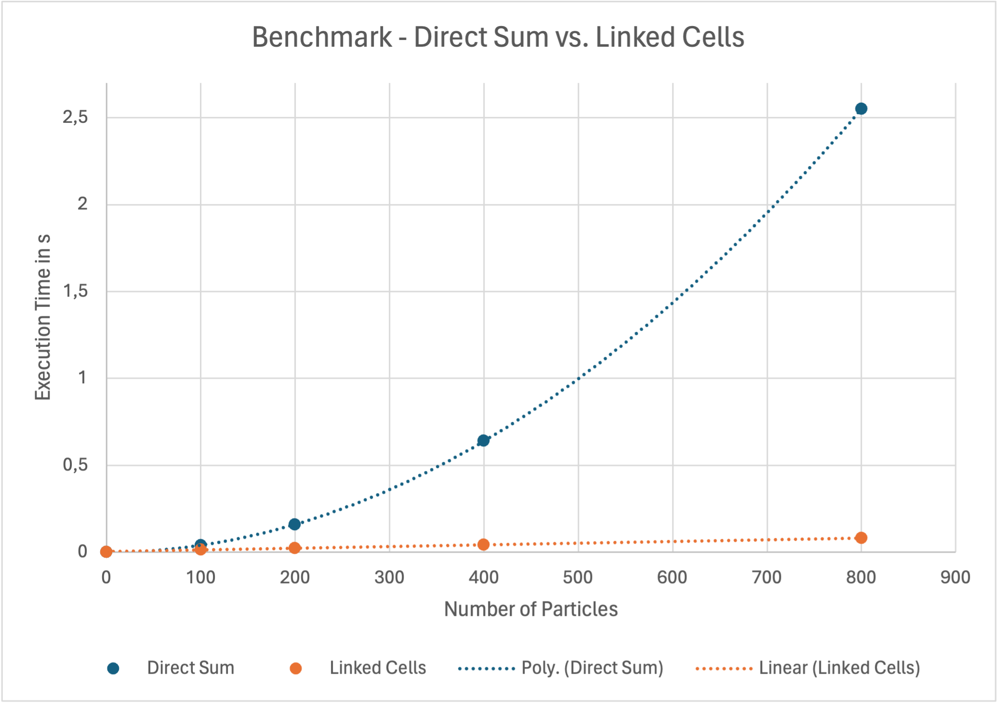

# Group A #

Members:

- [Daniel Schade](https://github.com/D4ni3lSch4d3)
- [Ashutosh Solanki](https://github.com/AshIsAtWork)
- [Robin Cleve](https://github.com/cleveee)

# Code #

* Link to Pull Request: [Pull Request for Assignment 3](https://github.com/AshIsAtWork/MolSim/pull/6)
* Compiler: gcc 11.4.0

# Report #

---

## Task 1: XML Input ##

### Introduction

In our recent assignment, we were tasked to integrate the XML Parsing. For this purpose, we used the Codesynthesis
XSD tool, which can be efficiently utilized within the modified Docker container as we are using apt to install xsdcxx.
To ensure comprehensive understanding and effective use of this tool, we reviewed its documentation and thoroughly examined
the provided test examples.

### XML Schema Creation

Subsequently, we developed an XML schema file, defining the structure of our input file. This schema file
is accessible [here](../../src/fileHandling/reader/XMLHandling/ConfigurationFile.xsd). The schema outlines the structure and
constraints of the input data, which includes the following elements:   
**General parameters**   
General information that is not directly associated with the simulation itself.   
- **Output File Name**: Specifies the name of the output file for simulation results. This name is constrained to
  contain only alphabetical characters.
- **Output Frequency**: Indicates the frequency at which simulation results are recorded. This value is restricted to a
  positive integer.   

**Simulation parameters**   
Here you have two options for your choice of a model.
- **Direct Sum**
    - **T_end**: Denotes the simulation end time, which is restricted to a positive double.
    - **Delta T**: Represents the time step size, constrained to a positive double.
    - **Force**: Specifies the type of force used in the simulation, either `LennardJonesForce` or `Gravity`. This is
      managed via enumeration in the schema file.
    - **Sigma**: Defines the sigma value for the Lennard-Jones force, restricted to a positive double.
    - **Epsilon**: Defines the epsilon value for the Lennard-Jones force, also restricted to a positive double.   <br><br>

- **Linked Cells**   
  Contains all parameters that the direct sum model contains and additional those three:
  - **DomainSize**: Indicates the size of the simulation domain using three positive doubles. The third double is optional
    for 2D simulations.
  - **rCutOff**: Specifies the cut-off radius for force calculations, restricted to a positive double.
  - **BoundaryConditions**: Determines the boundary conditions, either `Reflective` or `Outflow`, with each side of the
    simulation domain being independently configurable.   

**Particles and objects of particles to simulate**   
Here you can add any combination of single particles, cuboids and discs to the simulation.
- **SingleParticles**: Contains individual particle specifications:
    - **Size**: Number of single particles, restricted to a positive integer.
    - **SingleParticle**: Details of each single particle, including:
        - **Position**: Position of the particle, defined by three positive doubles.
        - **Velocity**: Velocity of the particle, defined by three positive doubles.
        - **Mass**: Mass of the particle, restricted to a positive double.   <br> <br>

- **Cuboids**: Contains cuboid specifications:
    - **Size**: Number of cuboids, restricted to a positive integer.
    - **Cuboid**: Details of each cuboid, including:
        - **Position**: Position of the cuboid, defined by three positive doubles.
        - **Velocity**: Velocity of the cuboid, defined by three positive doubles.
        - **N1, N2, N3**: Number of particles in each dimension, restricted to positive integers.
        - **Distance**: Distance between particles, restricted to a positive double.
        - **Mass**: Mass of the cuboid, restricted to a positive double.
        - **Brownian**: Brownian motion of particles, restricted to a positive double.
        - **DimensionBrownian**: Specifies the dimension of Brownian motion (0D, 1D, 2D, or 3D).   <br> <br>

- **Discs**: Contains disc specifications:
    - **Size**: Number of discs, restricted to a positive integer.
    - **Disc**: Details of each disc, including:
        - **Center**: Position of the disc center, defined by three positive doubles.
        - **Mass**: Mass of the disc, restricted to a positive double.
        - **InterParticleDistance**: Distance between particles, restricted to a positive double.
        - **Velocity**: Velocity of the disc, defined by three positive doubles.
        - **Radius**: Radius of the disc, restricted to a positive double.
        - **Brownian**: Brownian motion of particles, restricted to a positive double.
        - **DimensionBrownian**: Specifies the dimension of Brownian motion (0D, 1D, 2D, or 3D).

### Implementation Using XSD Tool

Upon finalizing the XML schema, we employed the Codesynthesis XSD tool to generate the necessary C++ classes. This was
achieved using the following command:

```bash
xsdcxx cxx-tree --std c++11 --generate-doxygen --generate-serialization --hxx-suffix .h --cxx-suffix .cpp ConfigurationFile.xsd
```

This command generated the [Collision.h](../../src/fileHandling/reader/XMLHandling/ConfigurationFile.h)
and [Collision.cpp](../../src/fileHandling/reader/XMLHandling/ConfigurationFile.cpp) files.

### Development of XMLReader

We then proceeded to develop the [XMLReader.cpp](../../src/fileHandling/reader/XMLReader/XMLReader.cpp) class, responsible for
parsing the XML file. We ensured adherence to the constraints specified in the schema file. These constraints are
automatically validated when the
following declaration is included in the XML definition:

```
xsi:noNamespaceSchemaLocation="../../src/fileHandling/reader/XMLHandling/ConfigurationFile.xsd"
```

This declaration links the XML file to the schema, ensuring automatic validation of the defined constraints.
Additionally, any parsing errors are detected and reported by the XMLReader class.

### Tree-Mapping and Future Enhancements

We opted for Tree-Mapping for the XML file due to its ease of use and comprehensibility. This approach also facilitates
additional features such as serialization back to DOM or XML, enabling the writing of modified XML files back to disk. This
may become useful when creating an XML writer in the next worksheet.

---

## Task 2: Linked-cell Algorithm ##

**1. Introduction**     
Note: If you are already familiar with the theory behind the linked-cell algorithm, you may skip the introduction.

In the last weeks, we experienced long execution times of our simulation even for a relatively small number of
particles. To be able to simulate scenarios containing
more molecules in an acceptable amount of time, the need of coming up with a new algorithm is unavoidable. The model
called `Direct Sum` we have been using in the last weeks calculated for each time step the force between all unique
pairs of particles. Because the number of unique pairs of particles is in the order of `O(n²)`, whereby `n` is the
number of particles, the running time increases approximately by a factor of `4` if we double the number of
particles `n` resulting in unacceptable long execution times for a large number of particles.    
Therefore, the only possibility to speed up the algorithm is to only process a subset of all pairs. Here comes
the `Linked Cell` algorithm into play belonging to the so-called short range algorithms. It only considers pairs of
particles that distance is below some threshold called cut-off radius `r`. The cut-off radius depends on the force used
for the simulation, and should be chosen in a way that the force between the particles that to each-other distance
exceed the cut-off radius is negligibly small.   
The last problem we have to overcome is the distance calculation being still in the order of `O(n²)`. The linked-cell
algorithm solves this problem by dividing the simulation domain into evenly sized cells in such a way that the distance
of a particle `p` within a certain cell to another particle `q` can be only smaller than the threshold `r`, if `q`
belongs to the same cell as `p` or a cell that is a direct neighbor of this cell.   
By making this simplification, we can decrease the number of calculations per time step to the order of `O(n)` resulting
in significantly better execution times, especially for large `n`, which we will show later by comparing the running
times of two models for different numbers of particles.

**2. Our implementation of the linked-cell algorithm**

**Creating a new particle container and introducing a new inheritance hierarchy**   
As a first step, we implemented a new particle container
called [LinkedCellsContainer](../../src/particleRepresentation/container/linkedCellsContainer/LinkedCellsContainer.h) and refactored the old
one for the direct sum implementation and gave it the new
name [DefaultParticleContainer](../../src/particleRepresentation/container/defaultParticleContainer/DefaultParticleContainer.h). Both particle
containers extend the abstract base
class [ParticleContainer](../../src/particleRepresentation/container/ParticleContainer.h) that provides the
possibilities of adding particles to the container and various means of iterating over particles and pairs of particles
within the container. The big advantage of this approach is that we can use the same in- and output methods for each
explicit container type without the need to provide multiple implementations. That guarantees a good code legibility and
avoids code duplication.

**Basic setup of the linked-cells container**   
As part of the implementation of the linked-cells algorithm there are multiple problems to solve:

* **Division of the domain into cells**: The requirement that has to be fulfilled is that all particles having a smaller
  distance than the cut-off radius `r` to some particle `p` belonging to some cell `c` should be part of cell `c` or of
  some cell being a direct neighbor off cell `c`. This guarantees that all particles within the cut-off radius are
  considered by only processing cell `c` and its neighbor cells. To achieve this, the size of a cell in each dimension
  should be at least `r`. This can be realized by setting the size of each cell in dimension `d`
  to `size_d = domainSize_d / N_d`, where `N_d` is the number of cells in dimension `d`. The number of cells in
  dimension `d` is set to `N_d = ⌊domainSize_d / r⌋`, where `r` is the cut-off radius. This leads to cell sizes being
  larger than the optimal cell size `r`, if the domain size in dimension `d` cannot be divided by `r`. Another point to
  consider was, where to locate the simulation domain in the coordinate system, because only its size was given, but not
  its location. We decided to define the front lower left point of the simulation domain as `(0,0,0)` being a good
  choice for further calculations.
  <br>
* **Data structure**: As suggested in the lecture slides, we flattened the 2/3-dimensional cell structure and store it
  in a one-dimensional vector. Each cell itself is a vector of particles. Because we do not know the number of cells and
  particles that each cell has to store before execution of the program, we cannot use an array with a constant size at
  this place. Additionally, we store two additional cells in each dimension one at the beginning and one at the end of
  each vector. These cells are called `halo cells`. All particles that leave the simulation domain during the simulation
  at some time will be assigned to one halo cell and are not part of the simulation for the rest of the simulation time.
  Each halo cell is infinitely big in at least one dimension that leads to the fact that all the space not being part of
  the simulation domain is covered by some halo cell. This implementation guarantees that each particle can be assigned
  to some cell, not matter where it is positioned. To access each cell easily in the one-dimensional vector, we
  implemented two methods `threeDToOneD` and `oneDToThreeD` that translate coordinates from one dimension into the
  other.   
  <br>
* **2D mode**: Some scenarios being simulated are living only in 2-dimensional space. In 2-dimensional space (the
  domainSize of the third dimension is 0), we can omit the halo cells at the top and the bottom saving a lot of memory
  and speeding up calculations. Therefore, our container provides a 2D mode which is automatically activated, if the
  size of the domain in the third dimension is set to 0.   
  <br>
* **Assigning particles to their cells**: For this we implemented the method `calcCellIndex` that deduces the particle's
  cell index from its position. Because all space is covered by some cell, each particle can be assigned one cell.
  Indeed, there is one nasty edge case we encountered only by coincidence, namely, when one coordinate is `NaN`. This
  should never happen during the simulation. Therefore, if the function is called with some particle that's position
  contains some `NaN` value, the program will be terminated with some error code, because to continue the simulation
  does not make any sense.   
  This method is used by another method called `updateCells` which is called in each time step after the positions of
  all particles have been updated. This ensures that in the next time step, all particles are assigned to their correct
  cells. This is really important for correct force calculations.

**Iterators and Newton's third law of motion**

* **Precalculation of "iteration routes"**: The container has to provide various options to iterate over different types
  of cells for realizing force calculation between the particles and boundary conditions. For reasons of better
  performance regarding the running time, we made the decision to precalculate all "iteration routes" in the constructor
  of the container once, before starting the simulation. Certainly, storing all indices of the different routes costs a
  lot of memory, especially if the size of the domain is large and the cut-off radius small, but most modern computer
  systems do not lack sufficient memory resources.   
  <br>
* **Grouping of halo and boundary cells**: Realizing the iteration over all boundary and halo cells was not that
  difficult. We decided to group cells being part of the same side of the simulation domain e.g. front, back, left etc.
  The possibility of iterating over halo cells or boundary cells respectively belonging to a specific side becomes
  really useful, if you want to define different boundary conditions for each side separately.  
  <br>
* **Iterating over unique pairs of particles**: Developing a strategy to iterate over all unique pairs of particles
  within the container, while ignoring all pairs of particles having a distance greater than the cut-off radius `r`, was
  definitely the most challenging part of this assignment sheet. The main idea of our strategy can be summarized the
  following:   
  <br>
  Iterate over all cells being part of the domain
    * Form all unique pairs `(p,q)`, where `p` and `q` are within the current cell `c` that is processed.
    * Form all unique pairs `(p,q)`, where `p` is part of cell `c` being currently processed and `q` belonging to some
      adjacent cell of `c`.<br><br>

  Unfortunately, exactly following this strategy will lead to the fact that each pair is processed twice. Consider two
  cells `c1` and `c2` being adjacent to each other. In one iteration `c1` will process `c2` as its neighbor and in some
  other iteration vice versa which leads to the result described above. To avoid this, we have to ensure somehow that
  if `c1` looked already at its neighbor `c2`, then `c2` should ignore `c1` when the time comes at which `c2` is
  processed. We have solved this issue by defining some kind of ownership. For each two cells `c1` and `c2` that are
  adjacent to each other either `c1` owns `c2` or vice versa. This is realized in the following way: Each cell owns all
  adjacent cells that are left, at the front or under itself. The following drawing should make this more clear: <br>  
   <br><br>
  If each cell considers only the adjacent cells that it owns, we achieve our goal that each unique pair of particles is
  exactly processed ones. Using this iterator, the application of Newton's third law of motion is child's play.<br>

**First test: revisiting the collision of two bodies**   
After all this rather theoretical stuff, we wanted to see the new algorithm in action. Therefore, we simulated the
scenario of the collision of two bodies once again in 2D, this time however, with more particles. To see our results,
click [here](Collision-of-two-Bodies-Ignoring-Boundary-Conditions.mp4). In the video you can see that all particles stop
moving as soon as they have left the simulation domain and have been assigned to a halo cell. At the time the video was
recorded, the boundary conditions were still neglected, which means that all particles that leave the simulation domain
are ignored for the rest of the simulation. Neither are their positions updated nor are they part of any further
calculations. We also have recorded another video afterward that demonstrates reflective boundaries.
Click [here](Collision-of-two-Bodies-Reflective-Boundaries.mp4) if you are interested.

**3. Benchmarks**   
Now, let's compare the new linked-cells algorithm with the old direct sum implementation to be able to tell whether all the work was worth it. To make the comparison fair, we ensured that no particle leaves the simulation domain during the simulation using the linked-cells algorithm or interacting in any other way with the borders. Therefore, we chose the simulation domain in such a way that the rectangle just fits in, to avoid that unnecessary many cells are created. Because we only calculated a few time steps with a small `deltaT` and small initial velocities (Brownian average velocity is set to `0.1`), the particles will barely move. We tested each model with `100`, `200`, `400`, `800`, `1000`, `2000`, `4000`, `8000` particles forming a 2D-rectangle (a square is not possible with these values). Instead of only `1` iteration, we conducted `100` iterations in each simulation, by choosing `deltaT = 0.001` and `endT = 0.1`. Doing just one iteration might not give precise results. Especially in the linked cells algorithm the running time per iteration depends significantly on the distribution of particles in the cells. The fewer individual cells the particles are distributed in, the worse the runtime (quadratic in the worst case that all particles are within a single cell). The fact that all particles are evenly distributed over the cells explains, why the linked cell algorithm is so fast in this test setting. Furthermore, doing only one iteration in the linked cells algorithm has the drawback that the running time will be significantly influenced by the setup of the linked cell container (note that we are precalculating all iteration routes) which is only done once and not in every iteration. This should be taken into account and averaged over multiple iterations. The average runtime per iteration can be easily received from the values in the table, by dividing each value by `100`. 
We used 2D Brownian Motion and a mesh width `h` of `1.1225` for creating the rectangles. As cut-off radius in the linked-cells algorithm we chose `r = 3` as in the other simulations.  
Like last time we used the following hardware:

* **Operating System**: `Ubuntu 22.04.4 LTS`
* **Processor**: `Intel(R) Core(TM) i5-6500 CPU @ 3.20GHz`
* **Memory**: `16 GiB`

| Number of particles | Form of the rectangle | Direct Sum | Linked Cells | Speed Up |
|---------------------|-----------------------|------------|--------------|----------|
| 100                 | 10x10                 | 0.04 s     | 0.150 s      | 3.75     |
| 200                 | 20x10                 | 0.16 s     | 0.024 s      | 6.67     |
| 400                 | 20x20                 | 0.64 s     | 0.043 s      | 14.88    |
| 800                 | 40x20                 | 2.55 s     | 0.080 s      | 31.88    |
| 1000                | 50x20                 | 3.89 s     | 0.10 s       | 38.90    |
| 2000                | 50x40                 | 15.90 s    | 0.21 s       | 75.72    |
| 4000                | 80x50                 | 64.29 s    | 0.41 s       | 156.80   |
| 8000                | 100x80                | 248.34 s   | 0.83 s       | 299.20   |

<br><br>

To get a plot with reasonable scales, we only visualized our results up to `800`.
After this point, the difference
between both implementations is so significant that visualizing it does not make any sense.
Therefore, we created the table above.
It immediately catches the eye that the linked-cells implementation is much faster than the direct sum implementation. 
The runtime class of the respective
algorithm is directly reflected in the results.
While the runtime of the linked-cells algorithm only doubles
approximately when the number of particles is doubled, linear increase: `O(n)`, the runtime of the direct sum
implementation quadruples approximately, which indicates a quadratic runtime complexity of `0(n²)`.
To emphasize the
complexity of each algorithm, we have embedded a linear and a polynomial regression of second order respectively in the
graph.   
As required, we embedded the plot into our doxygen documentation.
It can be found in the detailed description of the
class `LinkedCells`. Click [here](https://ashisatwork.github.io/MolSim/class_linked_cells.html#details) to have a look.

---

## Task 3: Boundary Conditions ##

Until this point, we neglected the behavior of particles that traversed the boundary of the simulation domain. In this
task, we implemented two different boundary conditions that are `outflow` or `reflective`. We implemented them in such a
way that the boundary condition can be set for each side independently, making it therefore possible to use both in
combination, for example `outflow` at the top and at all other sides `reflective`.

**Outflow**   
Implementing the outflow condition was straight forward. Because our container already provides a way to iterate over
all halo cells belonging to a specific side of the simulation domain, we just can iterate over all halo cells belonging
to the sides at which the boundary condition is set to outflow and delete all particles contained in them after each
position update. Deleting particles from vectors is not an efficient operation, because all elements being stored behind
the particle to delete have to be shifted. Therefore, it might be worth a try to use lists instead of vectors in halo
cells. Currently, we did not test if this makes any significant difference regarding the running time.

**Reflective**               
The realisation of the boundary condition `reflective` was more involved. We followed the suggestion in the assignment sheet and used the "ghost particle approach". Always when a particle gets near to some side of the simulation domain (closer than the six. root of two times sigma) which boundary condition is set to reflective, then a counter-particle is virtually created outside the domain with the same distance to that side and will apply a repulsive force at this particle pushing it away from the boundary.   
This approach is only stable for small time steps `delta_T`, because for large time steps the particle might cross the border before the force was high enough to repel it.   
[Here](Mixed-Boundary-Conditions.mp4) you can see a video with mixed boundary conditions. The boundary at the front is reflective, all other boundaries are set to outflow. 

---

## Task 4: Simulation of a Falling Drop - Wall ##
As part of this task, we added a new method to our class [ParticleGenerator](../../src/moleculeSimulator/particleGeneration/ParticleGenerator.h) that generates two-dimensional discs of particles. We also made it possible to specify discs within the XML file. Having these features implemented, we conducted a first experiment to test our simulation and let a disc fly against a reflective boundary. Because it is not exactly specified if the simulation should be in 2D or 3D we did both. For the 3D simulation, we shifted the center of the disc to (60,25,0.5) to position it vertically centered in the simulation domain. In the 2D case, we set the simulation domain to {120,50,0}, because the third dimension is not needed. 
* Simulation in 2D: [watch](Disc-against-reflective-Boundary-2D.mp4)
* Simulation in 3D: [watch](Disc-against-reflective-Boundary-3D.mp4)

---

## Misc ##
* We implemented the feedback from Manish by renaming some of our tests and making some other minor changes.
* We created tests for all stand-alone methods that we have added as part of this assignment sheet. Creating tests for the whole linked cells model as one would involve a huge amount of time that we do not have. Nevertheless, we checked its correctness thoroughly with ParaView and by going through the program step by step with the debugger and sanitizing all calculations. Because the model does not do more than calling the methods we tested thoroughly, we can assume that it will work how it is supposed to do. 
* We performed a code coverage by using cmake flags: We added `-DCMAKE_CXX_FLAGS= --coverage -DCMAKE_C_FLAGS=--coverage` to our cmake. This can be set in profiles and then be used to run coverage by using in-built clion options.
* We added valgrind to our docker container. It can be used over the command line or in build clion options (first, you have to set the executable to usr/bin/valgrind). 