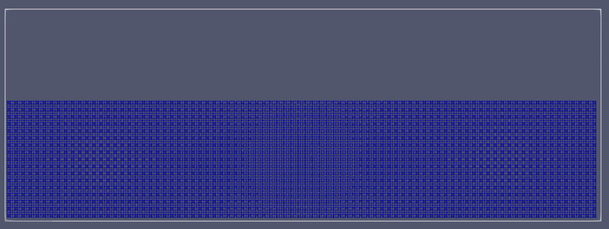
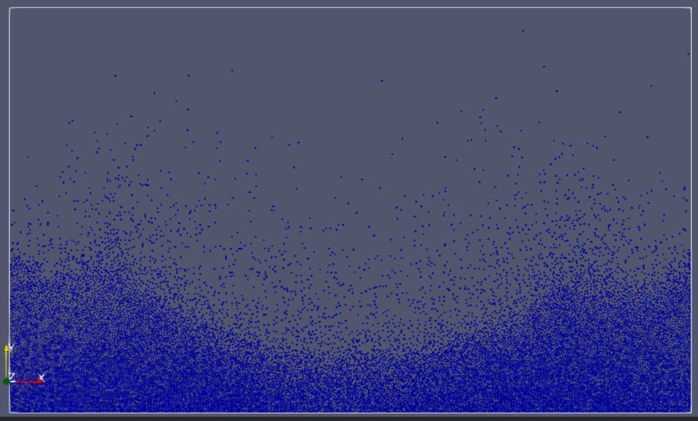

# Group A #

Members:

- [Daniel Schade](https://github.com/D4ni3lSch4d3)
- [Ashutosh Solanki](https://github.com/AshIsAtWork)
- [Robin Cleve](https://github.com/cleveee)

# Code #

* Link to Pull Request: [Pull Request for Assignment 3](TODO!!!)
* Compiler: gcc 11.4.0

# Report #

---

## Task 1: Thermostats ##

**1. Introduction**   
Often it is required to keep the simulated material or liquid at a constant temperature, sometimes you want to simulate heating or cooling processes. For these scenarios a thermostat is necessary. Temperature and the kinetic energy of the particles within the system share a close relation. In the slides we have been given two formulas that are important:
* `E_kin = (#dimensions * #particles * k_B * T) / 2` [1], where `k_B` is set to `1` and `T` the temperature of the system. 
* `E_kin = sum(0.5 * m_i * |v_i|²) over all particles p_i in the system` [2].   

By substituting both formulas into each other, we arrive at the following formula:
* `T = (sum(m_i * |v_i|²) over all particles p_i in the system)/(#dimensions * #particles)`.

We can use this formula to directly determine the temperature of the system using the velocities and masses of all particles.
To set the temperature of the system to a specific value `T_new`, we have to rescale the velocities of all particles according to the formula: 
* `v_i <-- b * v_i`, where `b := sqrt(T_new / T_current)`.

In reality, cooling and heating processes are processes that do not happen instantly but take some time. A bucket of water does not heat up instantly
from 0°C to 100°C. Therefore, in many cases we need to apply the temperature change gradually, which means that we limit the change of temperature of the system in one step to a specific value.    
Because the temperature of a system which particles do not move at all (having a velocity of 0 in all dimensions) is undefined (using the corresponding formula would result in a division by 0), the system has to be initialized with Brownian Motion before, whenever we want to use the thermostat. Like in the last assignments we use the Maxwell-Boltzmann distribution for this with a factor of `f_i = sqrt(T_init / m_i)` where `m_i` is the desired temperature of the system and `m_i` the mass of the particle to process.  

**2. Implementation**    
Having already been given these formulas and having derived the formula to calculate the temperature of the system using the velocities and masses of the particles the actual implementation of the thermostat was not a big challenge. Therefore, the configuration of the thermostat in the XML-file was much more annoying. There are many things the user can specify like whether the thermostat should be used at all whether the scaling should be applied gradually and so on. To see how the configuration works just have a look at one of our XML files, for example, [this](../../input/assignment-4/task3-gravity-equilibration.xml) here.   
For the actual implementation we defined the new class [Thermostat](../../src/moleculeSimulator/thermostat/Thermostat.h) which provides several useful methods for initialising the system with Brownian Motion or setting the temperature of the system (directly or gradually). The [Simulator](../../src/moleculeSimulator/Simulator.h) uses these methods for controlling the temperature of the system.   

**3. Tests**   
As required, we created three unit tests for heating cooling and holding a temperature. These tests can be found [here](../../tests/moleculeSimulatorTest/thermostatTest/ThermostatTest.cpp).

---

## Task 2: Simulation of the Rayleigh-Taylor Instability ##
**1. Introduction**   
The Rayleigh-Taylor instability is a famous phenomenon named after Lord Rayleigh and G. I. Taylor, two British mathematicians and physicists. It is an instability of an interface between two fluids of different densities, which occurs when the lighter fluid is pushing the heavier fluid. It can be observed almost anywhere in nature even in the Crap Nebula in the far reaches of the universe.   
To be able to properly simulate the Rayleigh-Taylor instability we had to extend our program by several new features including the periodic boundary condition and the Lorentz-Berthelot mixing rules.  

**2. Periodic boundaries**    
The realisation of periodic boundaries was quite challenging, especially in three dimensions when multiple mirroring in edges and corners had to be considered. We had to spend several hours in the debugger until everything met our expectations. Even the smallest error in the code did lead to bad results like segmentation faults, particles disappearing or explosions which sometimes only occurred after the program had been running completely fine for several minutes making debugging really hard and frustrating. Nevertheless, we did not give up and persevered until we finally succeed.   
The implementation of periodic boundaries comprises two major steps, the teleporting of particles that have left the domain on one side to the opposite side and the calculation of forces between particles that are close to the periodic boundaries and influence each other across the boundary.   
The repositioning of the particles was the easier part. The methods `fromLowToHigh` and `fromHighToLow` which can be found in the [LinkedCellContainer](../../src/particleRepresentation/container/linkedCellsContainer/LinkedCellsContainer.h) reposition a particle along a specific axis. For example, if the domain is of size `10` along the x-axis, and the x-coordinate of a particle is `11` the method `fromHighToLow` resets the x-coordinate to `11 - domainSizeX = 1`. Analogous the method `fromLowToHigh` adds `domainSizeX` to the x-coordinate. The method `teleportParticlesToOppositeSide` uses these methods to make particles that have left the domain and got administered to a halo cell appearing at the opposite side within the domain. This method is called at the end of each simulation step.   
The force calculation across the boundaries was more involved. We implemented it differently as suggested and did not insert particles from the opposite boundary into the halo layer on the opposite side, because this would result in copying a lot of particles, having a negative impact on performance. Instead, we only pretend that the molecules are in the halo cell by considering the opposite boundary cell as the corresponding halo cell. In order for the forces to be calculated correctly, we must first move the particles in the opposite boundary cell to the other side of the domain to simulate as they have been copied to the halo cell. After calculating the forces, this shift is then reversed. This is implemented by the method `applyForcesBetweenTwoCells` in the LinkedCellsContainer class. Generally speaking, the force calculation process for each side is split up into three steps. In the first step, the sides are considered, in the second step the edges and in the last step the corners. Because edges and corners should only be processed ones but belong to more than one side, we defined a model of ownership as in the previous assignment we do not want to go into further now. Details can be found in the code. 

Our implementation does not impose any restrictions on the specification of boundary conditions. You can mix them as you want and make even only one of two sides being opposite to each other periodic. Whether that makes sense remains to be seen.    
Last but not least, for reasons of transparency, we want to mention a nasty edge case that our implementation does not handle correctly. Luckily, it is really unlikely that this actually happens, and it only appears when mixing the boundary conditions outflow and periodic. The following picture visualizes the situation in a 2D setting. 

</img>   

The problem occurs when a particle is assigned to a boundary cell in the corner, leaves the domain in one time step, crossing the boundary with boundary condition outflow and ends up in a halo cell in the corner. From particles being in a halo cell in a corner, we do not know directly which boundary they had crossed. You had to add additional logic to determine that, which is complex, especially in three dimensions. At the moment, it depends on the order in which the boundaries are processed whether the particle is deleted (outflow boundary is processed first in this case) or teleported to the other side (periodic boundary is processed first) which might be correct by coincidence in about half of all cases.   

**3. Simulating Gravity**   
To simulate gravity we need to add a force pointing downwards to all particles in the simulation during each time step. This is done by the method `applyGravity` of the class [Model](../../src/models/Model.h). This method just adds a force along the y-axis to each particle according to the formula in the assignment cheat.  

**4. Lorentz-Berthelot Mixing Rules**    
Because we want to simulate different fluids consisting of different types of molecules the mass `m` and the Leonard-Jones Parameters `epsilon` and `sigma` should be configurable for each molecule individually. For the mass it has been already possible. To make it possible for `epsilon` and `sigma`, we added two new attributes with these names to the particle class. Additionally, we adapted the computation of the Leonard Jones force according to the Lorentz-Berthelot mixing rules.

**5. Running the simulation**   
Having implemented the features as stated above we could finally conduct the big simulation. The simulation comprises 10000 molecules being densely packed in a few cells leading to a long execution time. The following pictures present our result:

Initial position: The liquid with the higher density in yellow resides on top of the liquid with the lower density. 

</img>

Gravity acts on both liquids and lets them fall onto the ground.

</img>

The first signs of the Rayleigh-Taylor instability become visible as the lighter liquid pushes the heavier liquid. 

</img>

Some molecules of the lighter liquid have finally traversed the heavier liquid and reached the top.

</img>

End of the simulation: Both liquids have almost swapped their positions. 

</img>

If you want to have a look at our corresponding video, click [here](Rayleigh-Taylor-Instability.mp4).    
If you want to run the simulation on your own machine, execute the following command in your build folder:

```bash
./MolSim -f ../input/assignment-4/task2-big-experiment.xml -i xml -o vtk 
```

---

## Task 3: Simulation of a Falling Drop - Liquid ##

**1. Checkpointing**   
To use the state of the molecules being part of a previous simulation as one of the inputs for a new simulation we implemented a [TxtWriter](../../src/fileHandling/outputWriter/TXTWriter/TxtWriter.h) that writes the state of all molecules to a txt file at the end of the simulation. You can activate this option by setting the flag `--saveState` over the command line. After the simulation a file called `checkpoint` should appear in your build folder.   
If you want to start a new simulation with these molecules, you can load them back in using `--loadState checkpoint`. The configuration of you simulation and adding additional particles or structures of particles like discs is done in the xml file. Therefore, you can think of a checkpoint as additional input. For parsing the txt file, we extended the [TxtReader](../../src/fileHandling/reader/TxtReader/TxtReader.h) class that already existed.

**2. The equilibration run**   
Before letting the drop falling into the liquid we need to prepare the liquid. Representing the liquid by a single cuboid hardly comes close to reality because in reality the molecules are not perfectly arranged in a mesh width with equal distance to each other. A solution is to let gravity act on the fluid first for some time so that the molecules can arrange naturally. Additionally, we use the thermostat to set the initial temperature of the liquid to `0.5`. This provides the following result:  

"Liquid" before equilibration. It has too much structure and does not look like a liquid at all.   

</img>

As Gravity acts on the molecules, the molecules start sinking to the bottom of the basin and distribute themselves. 

</img>

After equilibration, we have something that actually looks like a liquid. 

</img>

If you want to see how the liquid equilibrates, click [here](Equilibration-Run.mp4). (Spoiler alert: not really exciting).    
If you want to run the equilibration phase on your own machine and save the state of the molecules for the next step, run the following command in your build folder:

```bash
./MolSim -f ../input/assignment-4/task3-gravity-equilibration.xml -i xml -o vtk --saveState 
```

**3. Conducting the actual experiment**    
Now, as we have prepared the liquid, we can continue with the actual experiment. We use the checkpointing feature we implemented to load the liquid back into our simulation and add additionally a 2D sphere (aka disc) that represents the drop. Then we let gravity accelerate the drop. The following can be observed.

Initial starting position:

</img>

The drop, accelerated by gravity, falls. Its molecules arrange in a beautiful symmetric pattern.

</img>

The drop dips into the liquid and passes its power on to it.

</img>

The liquid is displaced from the center, creating a wave.

</img>

The wave is reflected at the boundaries and moves again towards the center. 

</img>

The liquid starts equilibrating again. 

</img>

If you want to see how the liquid equilibrates, click [here](Falling-Drop.mp4).    
If you want to run the equilibration phase on your own machine and save the state of the molecules for the next step, run the following command in your build folder:

```bash
./MolSim -f ../input/assignment-4/task3-falling-drop.xml -i xml -o vtk --loadState checkpoint 
```

---

## Task 4: Performance Measurement and Profiling ##

We used the profiling tool `gprof` to analyze our program on our linux machine with Ubuntu installed. We analyzed our program while executing the first `1000` iterations of the big experiment of the Rayleigh-Taylor instability from task 2 because this scenario covers two different boundary conditions (periodic and reflecting), consists of `10000` molecules and should therefore yield representative results. To see our results, click [here](ProfilingResultsBeforeOptimization.txt).   
The following parts of the code consume the most runtime:   

| Method                                              | s    | %     | 
|-----------------------------------------------------|------|-------|
| LeonardJonesForce::compute                          | 3.00 | 37.27 | 
| LinkedCellsContainer::applyToAllUniquePairsInDomain | 1.83 | 22.73 |
| Particle::getX()                                    | 0.81 | 10.06 | 
| Model::updateForces()                               | 0.73 | 9.07  | 

These four methods account for `79.13%` of the total execution time. It therefore makes sense to focus on these methods when optimizing the program. It is not surprising that the program spends the most time computing the Lennard Jones force between two particles. The fact that the program spends a lot of time iterating over cells of the linked cells container was also to be expected. But what is surprising is that the program spends so much time in the getter method for the position of a molecule. We will come back to this in the next task.   

We also ran our program on the linux cluster (the first 1000 iterations of the Rayleigh-Taylor instability of task 2). These are our results:   

|                                |         |
|--------------------------------|--------:|
| **Running time**               | 19.77 s |
| **Molecule updates per second** |  505646 |
    
  

---

## Task 5: Tuning the sequential Performance ##

**1. General Overview**   
Throughout the project, we already cared for efficiency and optimized our functions.  We focused so far on algorithmic optimizations to ensure that we compute only that which is necessary. Therefore, from an algorithmic perspective, the things coming directly to the mind have been already realized like the precomputation of indices to ensure fast iteration over halo cells, boundary cells and neighbors of each cell within the domain. As we already mentioned in task 2, we could do without halo cells completely, which would definitely reduce the memory requirements of our program, because there are a lot of halo cells, especially in three-dimensional space. This, however, would require huge changes in the program and some additional logic we do not have time to implement at the moment. Furthermore, we do not want to mess up our working program. It would be fascinating to know if an implementation without halo cells is actually faster, because you need more logic if you want to do without them.   

**2. Ideas for optimization**
 * As already identified in the last task, our program currently spends a lot of time with calling getter methods. It therefore makes sense to try to reduce the number of getter calls. The classes `LeonardJonesForce`, `LinkedCellsContainer` and `Model` are the classes which calls them most often. Therefore, it could be useful to grant these particles direct access to all attributes of the class `Particle` so that they do not need to call any getters anymore. In C++ this can be easily realized by making these classes friends of the class `Particle`.   
  After this optimization step, we analyzed our program again using gprof. The results can be found [here](ProfilingResultsAfterFirstOptimizationSteps.txt). As expected, getters and setters are hardly ever called and thus disappear completely from the upper rows of the statistics. The runtime of the program has also improved significantly. We would never have thought that a simple change like that could have such a positive impact on the runtime.   <br><br>

 * The next idea addresses the computation of the Leonard-Jones force between two particles. According to gprof this is the functions our program spends the most time in, so it is definitely worth having a closer look at this function.


