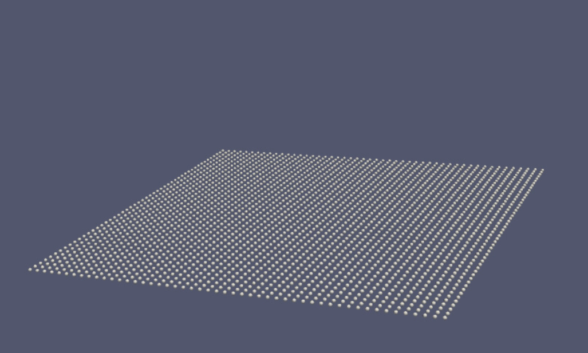
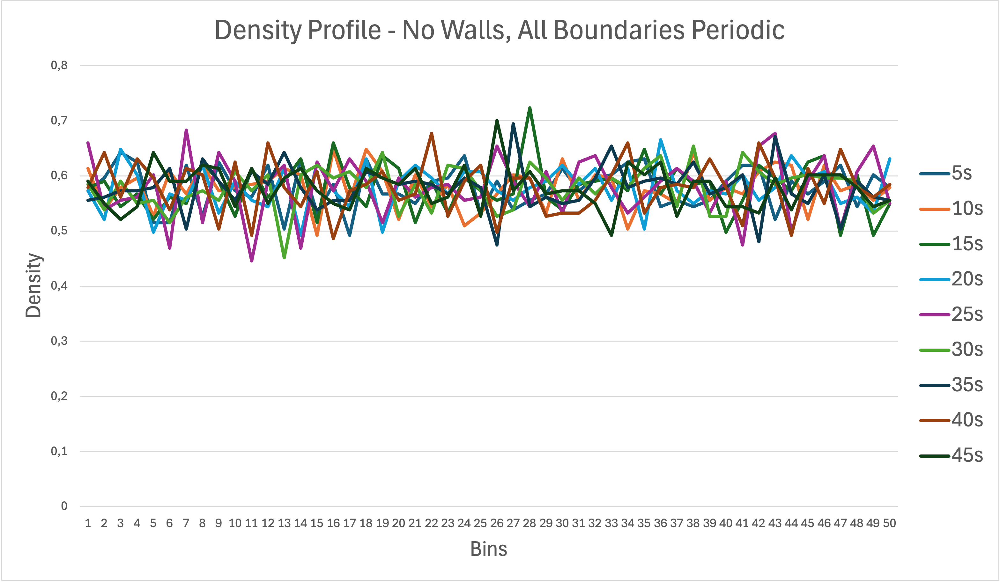

# Group A #

Members:

- [Daniel Schade](https://github.com/D4ni3lSch4d3)
- [Ashutosh Solanki](https://github.com/AshIsAtWork)
- [Robin Cleve](https://github.com/cleveee)

# Code #

* Link to Pull Request: [Pull Request for Assignment 5](TODO!)
* Compiler: gcc 11.4.0

# Report #

---

## Task 1: Simulation of a membrane ##   
**1. Introduction**   
This task has driven us crazy. After we implemented everything, the simulation exploded always after ca. 1000 iterations. We tried to debug our code for days and weren't able to find the error. Everything seems correct, but there still had to be an error skillfully hiding from us. Asking our supervisor Markus for help was then the only option which was left. Thankfully, Markus found the issue which had nothing to do with the implementation of the membrane itself but with the position updates. This mistake was in our code from week one on, because we interpreted the formula for the position updates that was given on the slides wrongly and used the old force instead of the current one. For simulations only using Lennard-Jones forces this mistake was so small that it was not observable with ParaView. Because the harmonic force acting between adjacent particles in the membrane responds strongly to minor inaccuracies, small errors quickly added up and messed up the simulation. After correcting the error, finally, everything worked as expected.   

**2. Implementation**   
To simulate a membrane we had to add some new features to our program:

- **Specification of neighbors**   
In a membrane, each molecule has up to four direct and four diagonal neighbors which have to be stored somehow. To do this, we first assigned to each particle a unique identifier. Additionally, each particle administers two vectors in which all direct and diagonal neighbors are stored. Well, to be accurate, not all neighbors. Because we are still trying to use Newton's third law of motion for force calculations, it is only necessary that only one of two adjacent particles knows that they are neighbors. Therefore, on average, each particle only stores up to two direct and diagonal neighbors saving memory and computation time. All this takes place in the method `generateMembrane` in the class [ParticleGenerator](../../src/moleculeSimulator/particleGeneration/ParticleGenerator.h).   


- **Harmonic force**   
The harmonic force acts between adjacent particles in a membrane. We added this new type of force as new class [HarmonicForce](../../src/moleculeSimulator/forceCalculation/harmonic/HarmonicForce.h) that derives from our abstract base class [Force](../../src/moleculeSimulator/forceCalculation/Force.h) thus being elegantly integrated into our code base. 


- **Preventing self-penetration of the membrane**   
To prevent self-penetration of the membrane that happens when non-adjacent particles come close to each other (e.g. when the membrane folds), we have to apply the reflective part of the Lennard-Jones force to them. Forces within the membrane are handled by the following method: `updateForcesMembrane` in the class [LinkedCells](../../src/models/linkedCells/LinkedCells.h). 


- **Pulling chosen particles**   
To observe the dynamic behaviour of the membrane, we apply a constant pulling force to a subset of the particles. To do this, we added a small routine called `pullMarkedParticles` to our method `updatedForces` in the class [LinkedCells](../../src/models/linkedCells/LinkedCells.h). It iterates over all particles, checks if they are marked and if this is the case applies a constant force to them. We hardcoded which particles should be pulled, because there is no need to change this, and we were too lazy to make this configurable through the xml file. 

**3. The Experiment**   
Observing the dynamic behaviour of a membrane is fascinating and for us the coolest experiment in this course. It actually looks like a napkin that is lifted from a table.   

<div style="display: flex; flex-wrap: wrap; justify-content: space-around; ">
    <div style="padding-bottom: 50px; text-align: center; width: 45%;">
      
      [1] Starting point of the simulation.
    </div>
    <div style="padding-bottom: 50px; text-align: center; width: 45%;">
      
      [2] As four particles are pulled up, the membrane starts folding.
    </div>
   <div style="padding-bottom: 50px; text-align: center; width: 45%;">
      
      [3] Turning point. As the pulling stops, gravity starts to pull the membrane down. 
   </div>
   <div style="padding-bottom: 50px; text-align: center; width: 45%;">
      
      [4] End of the simulation: Membrane is about to resume its starting position.
   </div>
</div>

The corresponding video can be found [here](Membrane.mp4).   

For reproducing our results, run in your build folder the following command:   

```bash
./MolSim -f ../input/assignment-5/task1-membraneSimulation.xml -i xml
```

---

## Task 2: Parallelization ##   
**1. Introduction**   
Changing from two-dimensional scenarios to three-dimensional scenarios comes along with a surge on required computation time as the number of molecules increases exponentially. A square with 10 molecules in each dimension comprises 100 molecules. A cuboid with 100 molecules in each dimension comprises 1000 molecules. As the Linked Cell algorithm locally exhibits a quadratic running time in the number of molecules, the computational effort increases dramatically.Because from an algorithmic perspective we cannot improve the asymptotic running time any further the only way to end up with acceptable running times is parallelization. Nevertheless, parallelization will only speed up the program by a constant factor, in the perfect case by the number of cores we have available. Therefore, simulating huge scenarios is still not possible if waiting centuries for the result is no option for you.   

**2. Setup**   
In this course we are using the OpenMP API for parallelization for it is comparably easy to get started with and to include it in your project. OpenMP parallelizes programs by distributing the work of loops (as evenly as possible) on multiple threads. This is achieved by defining parallel regions using #pragma directives.   

To add OpenMP to you our project we just needed to add three lines to our `CMakeLists.txt` file:   

1. Searching for the package: `find_package(OpenMP)`
2. If the package is found, link it to our project target MolSim: `target_link_libraries(MolSim PUBLIC OpenMP::OpenMP_CXX)`   

If you do not want to use any parallelization, it is still possible to use our program without OpenMP. All code that depends on this library is nested in precompiler statements and ignored if OpenMP is not available. To install OpenMP on your Linux machine, have a look at our [Readme](../../README.md).   

**3. Parallelization Strategies**   
As required we developed two different parallelization strategies and out of curiosity a third one which can be selected through the xml input file. An example you can find [here](../../input/assignment-5/task3-Rayleigh-Taylor-instability-3D.xml). For reasons of backward compatability, specifying the parallelization strategy is optional. If it is left out, the program will run sequentially. If specified, there are three possible values:
* `None`: No parallelization, program will run sequentially.
* `Linear`: Use parallelization, the linear scheduling is used.
* `Skipping`: Use parallelization, the skipping scheduling is used. 
* `Reduction`: Use parallelization, no scheduling, reduction is used to avoid race conditions.

All three strategies parallelize the main part of the force calculation happening in the function `applyToAllUniquePairsInDomain` as profiling shows that the program spends over 90% of the time in this part of the program. Furthermore, we have parallelized the velocity and position updates, not because they are contributing a lot to the overall running time of the program but because its parallelization is quite easy as all iterations in the loop are independent and have equal costs. Therefore, a single OpenMP directive does the job. Additionally, we parallelized the processing of boundary conditions, for the computation in three dimensions is quite costly. Because we have chosen in the previous weeks to strictly separate the handling of boundary conditions from the other force calculations for the sake of a clear code structure, parallelizing this was not that easy. From the perspective of parallelization, it would have been better to include it in the method `updateForces`, because then, parallelizing only this function would have been sufficient. For boundary conditions, we are using a dynamic schedule, because the costs of different types of boundary conditions differ a lot. Summarizing, we have parallelized everything that contributes significantly to the overall running time of the program. Therefore, we expect a great benefit from parallelization. But let's not rejoice too soon. There may be various problems that reduce performance. Time measurements in the following sections will provide clarity.


Parallelizing the function `applyToAllUniquePairsInDomain` is not as simple as it seems at the first glance, because iterations are not independent. Therefore, adding just one OpenMP directive would lead to race conditions. One race condition that could happen is when two threads are processing the same cell and are updating the force of the same molecule simultaneously. We could imagine the following order of operations:   

1. Thread 1 reads the force of molecule 1.
2. Thread 2 reads the force of molecule 1.
3. Thread 1 adds the new calculated force to the force value it has read.  
4. Thread 2 adds the new calculated force to the force value it has read. 
5. Thread 1 updates the force of molecule 1.
6. Thread 2 updates the force of molecule 1.

The problem is here that the force that thread 1 has calculated is lost, because thread 2 works with an outdated force value. We have to avoid somehow that threads update the same molecule simultaneously. We had two ideas to prevent this:   

1. Make access to each molecule exclusive. 
2. Make access to each cell exclusive.   

As big simulations contain a lot of molecules, assigning a lock to each molecule would be too much overhead. Better is option two that prevents threads operating on the same cells simultaneously. Making access to each cell exclusive is a good trade-off between the number of required locks and the goal to assign as least resources as possible exclusively to one thread. Of course, in a perfect world, the work is distributed over all threads in such a way that at no time two threads want to access the same exclusive resource. This is exactly what we are trying to achieve with our second parallelization strategy.

Maybe first a few words how the work is assigned to each thread in the first two strategies. This happens in the method `applyToAllUniquePairsInDomainParallelHelper` in the class LinkedCellContainer. The shared variable `nextCellToSchedule` keeps track of the index of the vector that contains the schedule prescribing the order in which the cells should be processed. As all available threads execute this code concurrently, the access to this shared variable has to be synchronized, so that no cell is processed twice. The processing of one cell consists of processing the cell itself and all neighbors that this cell owns. Therefore, the work is distributed dynamically to whatever thread that is idle. This approach ensures that the work is distributed over all threads more or less evenly even if the particle distribution is inhomogeneous. A disadvantage of dynamic scheduling compared to a static assignment of the work is that it has a little overhead at runtime because it requires additional synchronization. Nevertheless, we think it being the right approach as a static distribution only makes sense when the cost of processing each cell is almost identical, which is definitely not the case when particles are concentrated on only a tiny fraction of all available cells. A few last words why we did not use the scheduling provided by OpenMP but did implement it by ourselves. OpenMPs scheduler is more efficient than our approach, but as we want to compare two different schedules, we want to have full control over the scheduling to make the comparison as meaningful as possible and not only assume what happens under the hood of OpenMP.   

The first schedule, used by our first parallelizing strategy, we call `linear`, as it traverses each cell in the linked cells container in order by first processing cells along the x-axis, followed by the y-axis and finally the z-axis. For the first 100 iterations of the three-dimensional Rayleigh-Taylor instability, the first parallelization strategy exhibits the following running times:   

Note: All time measurements have been conducted on Linux cluster `cm2_inter`.  

| **Number of threads** | **Running time** | **MUPS** | **Speedup** |
|-----------------------|------------------|----------|-------------|
| 1                     | 82.36s           | 121412   | -           |
| 2                     | 62.59s           | 159774   | 1.32        |
| 4                     | 52.56s           | 190248   | 1.57        |
| 8                     | 40.38s           | 247622   | 2.04        |
| 14                    | 32.48s           | 307885   | 2.54        |
| 16                    | 31.05s           | 322113   | 2.65        |
| 28                    | 26.75s           | 373769   | 3.08        |
| 56                    | 25.17s           | 397283   | 3.27        |

The corresponding graph can be found at the end of this section.   
The time measurement shows that the performance of this parallelization strategy is everything else but good. The speedup for adding more threads is low right at the beginning. It improves when adding more threads, but the gain for adding another thread decreases as the number of threads already in use increases. This can only mean that threads are blocking each other as a result of synchronization of the cells. An analysis with VTune confirms that hypothesis. Threads spent a lot of time waiting that cells they want to access become available. By having a closer look at the order in which cells are scheduled, this is not a big surprise. Cells that are processed in parallel are adjacent to each other, which means that the set of neighbors the threads trying to process in parallel overlaps, leading to resource allocation conflicts and waiting times.   

Our next strategy tries to solve this problem by scheduling cells in an order that minimizes resource allocation conflicts. This is achieved by skipping every second cell along each axis. The following sketches show a visualization of the old and the enhanced schedule.  

<div style="display: flex; flex-wrap: wrap; justify-content: space-around">
    </img> 
    </img> 
</div>

Let's see then if this strategy performs better.   

| **Number of threads** | **Running time** | **MUPS** | **Speedup** |
|-----------------------|------------------|----------|-------------|
| 1                     | 83.02s           | 120447   | -           |
| 2                     | 46.34s           | 215802   | 1.79        |
| 4                     | 26.08s           | 384212   | 3.19        |
| 8                     | 18.64s           | 536626   | 4.46        |
| 14                    | 15.14s           | 660706   | 5.49        |
| 16                    | 14.63s           | 683749   | 5.68        |
| 28                    | 13.42s           | 745432   | 6.19        |
| 56                    | 13.72s           | 728797   | 6.05        |

As measurements show, the new schedule improves running time significantly but reaches its limits when the number of threads reaches double-digits. As the number of threads increases, the schedule cannot ensure that adjacent cells are processed concurrently leading to resource conflicts.

Even if the improvement of this strategy compared to the old one is not bad, out of curiosity, we want to test a third strategy approaching the problem differently. Making access to cells exclusive will always lead at some point to lock contentions when the number of threads gets high enough. There is no way of traversing the cells to avoid this. If we want to get faster, we have to get rid of the locks and find some other way to circumvent race conditions. An alternative way is to use reduction on the force of each particle. Each thread gets its own copy of the force variable in which they store their results. At the end of each iteration, all intermediate values are summed up and form the final result. Because now, each thread operates on its own force copy, race conditions cannot happen, and therefore we can do without locks.   
Even if we do not need any type of synchronization between the threads, we are afraid that the overhead that comes along with reduction is too high and destroys performance. The following time measurements will show:     

| **Number of threads** | **Running time** | **MUPS** | **Speedup** |
|-----------------------|------------------|----------|-------------|
| 1                     | 85.77s           | 116585   | -           |
| 2                     | 47.12s           | 212202   | 1.82        |
| 4                     | 26.48s           | 377628   | 3.24        |
| 8                     | 19.11s           | 523236   | 4.49        |
| 14                    | 16.00s           | 625170   | 5.36        |
| 16                    | 15.44s           | 647585   | 5.55        |
| 28                    | 15.04s           | 664777   | 5.70        |
| 56                    | 14.74s           | 678487   | 5.82        |

Alas, as we have already suspected, this strategy is subjected to failure because the overhead of the reduction is too big. However, it was worth a try and we learned something new.   

Here you can see a direct comparison of the speedup each strategy achieved.

<div style="display: flex; flex-wrap: wrap; justify-content: space-around">
    </img> 
    </img> 
    </img>
</div>

**4. Contest**   
In all likelihood, we have no chance of being in the top half of the competition with our strategy, as the performance gain is marginal, especially in 2D simulation. There are definitely other strategies whose performance is significantly better. Since this is the first time we have worked with OpenMP, it's probably no shame if not everything works the way you want it to right at the beginning. 

***2D***   

| **Compiler**                    | g++                      |                     icpc |
|---------------------------------|--------------------------|-------------------------:|
| **Running time**                | 7.04 s                   |                   3.36 s |
| **Molecule updates per second** | 1422340 MUPS/s           |           2967860 MUPS/s |
| **#Threads used**               | 4                        |                        7 |
| **Corresponding input file**    | benchmark-contest-2D.xml | benchmark-contest-2D.xml |

***3D***   

| **Compiler**                    | g++                      |                     icpc |
|---------------------------------|--------------------------|-------------------------:|
| **Running time**                | 143.60 s                 |                 141.06 s |
| **Molecule updates per second** | 696399 MUPS/s            |            708941 MUPS/s |
| **#Threads used**               | 28                       |                       28 |
| **Corresponding input file**    | benchmark-contest-3D.xml | benchmark-contest-3D.xml |


What is fascinating is that the code compiled with icpc performs better, even much better in the 2D scenario. For both compilers, we used the O3 flag and for g++ some additional flags we have been using in the last sprint as well to enable further optimisation.    

Here you can find some instructions on how you can reproduce our results:   

* Login into the linux cluster.
* Clone our repository and change into the directory `MolSim`.
    ```bash
    git clone https://github.com/AshIsAtWork/MolSim.git
    ```
* Checkout the commit we used for our time measurements.

    ```bash
    git checkout 475c110b
    ```
* For the g++ compiler you can use our script:
  * Change into the `scripts` directory, run our script that automatically loads all required modules into the environment, builds the program and prepares the bash script you will have to submit to the scheduler in the next step.   
    * 2D scenario:
    ```bash
    ./cluster_setup.sh MolSim_A inter inter_cm2 ALL <your email> 1 4 00:01:00 ../input/assignment-5/benchmark-contest-2D.xml xml vtk -t -O
    ```
    * 3D scenario:
    ```bash
    ./cluster_setup.sh MolSim_A inter inter_cm2 ALL <your email> 1 28 00:01:00 ../input/assignment-5/benchmark-contest-3D.xml xml vtk -t -O
    ```
  * Submit the bash script to the scheduler to queue our program for execution.
      ```bash
      sbatch ../cluster_start.cmd
      ```
  * Wait until your program is scheduled for execution. You can check the status of your jobs with the following command:
      ```bash
      squeue --cluster inter --me
      ```
  * When your job has finished, there should be an output file in the build folder. This contains the performance measurements.


* For the icpc compiler you have to do the setup manually as our script only works with gcc:
  * Change into your build folder.
  * Load all necessary modules.
    ```bash
    module load openmpi/4.1.2-intel21 && module load slurm_setup && module load cmake/3.21.4 && module load boost/1.75.0-intel21 && module load xerces-c/3.2.1
    ```
  * Build the code.
    ```bash
      cmake -DCMAKE_BUILD_TYPE=Release -DCMAKE_CXX_COMPILER=icpc -DCMAKE_C_COMPILER=icc ../ && make
    ```
  * Submit the script.
    * 2D scenario
    ```bash
    sbatch ../scripts/bash_icpc_2D.sh
    ```
    * 3D scenario
    ```bash
    sbatch ../scripts/bash_icpc_3D.sh
    ```
  * Wait until your program is scheduled for execution. You can check the status of your jobs with the following command.
      ```bash
      squeue --cluster inter --me
      ```
  * When your job has finished, there should be an output file in the build folder. This contains the performance measurements.
  
---

## Task 3: Rayleigh-Taylor instability in 3D ##   

**1. Introduction**   
This simulation is by now the largest one we ever conducted. The two liquids comprise overall 100.000 molecules. It is startling how fast the number of molecules grows when you add an additional dimension and conduct the simulation in 3D. Before running the simulation we parallelized the main force calculation loop which speed up our program a lot. Nevertheless, the calculation of forces occurring at periodic boundaries is in 3D computational-heavy as well, because there are existing much more boundary cells. At the time at which we ran the simulation the calculation of periodic boundaries was still sequential, which lead to a long running-time of about 20 hours on our Linux machine with an Intel(R) Core(TM) i5-6500 CPU @ 3.20GHz processor with 4 cores.

**2. Implementation**    
As we already implemented periodic boundaries in three dimensions as part of the last worksheet, there was nothing to do except creating the scenario and execute it. Information on the implementation of periodic boundaries (especially in 3D) can be found in the [previous report](../assignment-4/Report.md).   

**3. Experiment**   
Let's see the results of the simulation:    

<div style="display: flex; flex-wrap: wrap; justify-content: space-around; ">
    <div style="padding-bottom: 50px; text-align: center; width: 45%;">
      
      [1] Starting point of the simulation.
    </div>
    <div style="padding-bottom: 50px; text-align: center; width: 45%;">
      
      [2] The first signs of the Rayleigh-Taylor instability become visible as the lighter liquid pushes the heavier liquid.
    </div>
   <div style="padding-bottom: 50px; text-align: center; width: 45%;">
      
      [3] Some molecules of the lighter liquid have finally traversed the heavier liquid and reached the top.
   </div>
   <div style="padding-bottom: 50px; text-align: center; width: 45%;">
      
      [4] End of the simulation: Both liquids have almost swapped their positions.
   </div>
</div>

* If you want to watch the video of the simulation, click [here](Rayleigh-Taylor-Instability-3D.mp4).

* If you want to run the simulation on your own machine (takes a really long time), change into your build folder and run:
  ```bash
  OMP_NUM_THREADS=<#threads> ./MolSim -f ../input/assignment-5/task3-Rayleigh-Taylor-instability-3D.xml -i xml
  ``` 
  ,where `<#threads>` is the number of threads you want to use.


## Task 4: Nano-scale flow simulation (Option A) ##

**1. Introduction**   
We decided to go for the nano-scale flow simulation instead for crystallization of argon, because it seemed to us a little bit more accessible. The big formula in task 5 is intimidating, even though you probably only have to copy it one-to-one from the worksheet. What could have been a bigger problem is the computation of the diffusion, because you have to apply special treatment for particles that crossed a periodic boundary which seemed to be involved at the first glance. Furthermore, we did not want to have anything more to do with periodic boundaries, because their implementation had already demanded a lot from us. Last but not least we think that a liquid traversing a little tube is more intuitive than observing a gas assuming different states.

**2. Implementation**   
The first problem we had to solve was how we make the walls fixed. Particles belonging to walls should not move, and no force should be exerted on them. Nevertheless, they should apply forces on other molecules that are not fixed. To distinguish between fixed and non-fixed particles, we added a new attribute `fixed` of type bool to the class `Particle`. A value of `true` indicates that the particle is fixed, a value of `false` that it should be treated normally. Before applying forces to a particle, altering its position or its velocity, we check first if the particle is fixed. If this is the case the particle will not be modified. For this we needed to add multiple if statements to our code. This is not pretty, and it will slow down our simulation a little bit even when no fixed particles a part of the simulation. A big advantage of this approach is that it is rather easy to implement, and does not require us to change the structure or logic of our program. In order to add walls or other structures to the simulation that do not move, we added to each element (cuboid, disc, sphere) the option in our xml-file to make it fixed.    

The next step was about implementing the new thermostat. We made the decision to introduce a new inheritance hierarchy by adding the abstract base class [Thermostat](../../src/moleculeSimulator/thermostats/Thermostat.h) from which the old thermostat, now renamed to [DefaultThermostat](../../src/moleculeSimulator/thermostats/DefaultThermostat.h) and the new thermostat, we called [FlowThermostat](../../src/moleculeSimulator/thermostats/FlowThermostat.h), inherit. We have gone for this approach multiple times in this project, and it always turned out to be a reasonable decision. It makes your code well-structured and extensible, because you can add other types of thermostats without making any major refactoring. You can specify which type of thermostat is used in the xml-file.   
The new thermostat resembles the old one with the important difference that you have to subtract the average velocity of the fluid in each step. This change achieves that the total velocity of the fluid is ignored. Now the temperature defines how much each particle's velocity deviates from the average. A high temperature means that the velocity distribution is heterogeneous, a low temperature means vice versa that it is homogeneous. This is useful for studying flows because the thing we are interested in is the relative velocity the particles have to each other rather than the total velocity of the fluid. For example, we want to know where in the tube the liquid moves relatively fast and where slower.   

To be able to study flows thoroughly, we must have access to more data than only the visualization in ParaView. Therefore, we implemented a profiler represented by the class [Statistics](../../src/moleculeSimulator/statistics/Statistics.h) that computes after every 10000 iterations a velocity and density profile of the liquid in observation and writes the collected data to a csv file to simplify further processing, for example, with Excel. For writing the csv files, we added a new writer [CSVWriter](../../src/fileHandling/outputWriter/CSVWriter/CSVWriter.h). Like suggested, we divided the x-axis into 50 bins and computed the average velocity in y-direction and the density of the fluid in each bin. After the simulation has finished the two profiles can be found in the directory `statistics` of your build folder.   

**3. Experiments**   

***3.1. First experiment***   
Time to test our setup and conduct a first experiment. We begin with the one given in the assignment. We got the following profiles:

<div style="display: flex; flex-wrap: wrap; justify-content: space-around">
    </img> 
    </img> 
</div>

* If you want to watch the video of the simulation (not interesting) click [here](nano-scale-flow/standard-experiment/Nano-Scale-Flow-Standard-Experiment.mp4).   

* If you want to run the simulation on your own machine, change into your build folder and run:
  ```bash
  OMP_NUM_THREADS=<#threads> ./MolSim -f ../input/assignment-5/task4-nano-scale-flow.xml -i xml
  ``` 
  ,where `<#threads>` is the number of threads you want to use. 
* The complete velocity profile you can find [here](nano-scale-flow/standard-experiment/Velocity-Profile-Standard-Experiment.csv).
* The complete density profile you can find [here](nano-scale-flow/standard-experiment/Density-Profile-Standard-Experiment.csv).

In the graphs, we have limited ourselves to visualizing the first 45 seconds of the simulation. This has multiple reasons. The first one is that including more data would decrease the clarity of the graphs. The second reason is that the average velocity of the fluid increases during the simulation so that we would have to extend y-axis of the graph to -200 if we wanted to show the whole plot resulting in the fact that series would overlap. Last but not least, the first 45 seconds provide you with everything you need for understanding what is happening. Observations stay qualitatively the same as the simulation goes on.   
As you might have noticed, we included the velocity profile at the beginning of the simulation (0s) but excluded the density at 0s in the graphs. This is again due to visualization purposes.   

What catches the eye immediately is that the downward velocity and density of the liquid are higher in the center of the tube than at the edges close to the walls. This difference in average velocity along the y-axis increases as the simulation progresses from which we can conclude that forces pointing downwards along the y-axis are higher for particles in the center than the ones close to the walls. Because of the gravitational force applied to each particle in negative y-direction is the same for all particles (energy is distributed evenly), there must happen some kind of energy transfer. We can think of two possibilities:    

1. Energy is transferred from particles close to the walls to particles in the center.
2. Energy is transferred from particles close to the walls to the particles at the walls and lost.

At the moment, we cannot tell what is exactly happening; maybe both presumptions are wrong. We need to conduct more experiments.    

***3.2. Increasing sigma of the particles within the walls***   
As starting point we want to study the effect when changing the Leonard-Jones parameter sigma of the particles belonging to the walls. As sigma controls mathematically the distance of the particles at which the Leonard-Jones potential exhibits its minimum and therefore the distance to which the force is repulsive we expect that increasing sigma will increase the gap between the wall and the fluid, because repulsive forces are getting stronger earlier and apply within a larger interval. We increased sigma from 1.1 to 3.0. Our simulation yields the following results for the first 45 seconds.    

<div style="display: flex; flex-wrap: wrap; justify-content: space-around">
    </img> 
    </img> 
</div>

* If you want to watch the video of the simulation, click [here](nano-scale-flow/larger-sigma-walls/Nano-Scale-Flow-Larger-Sigma-Walls.mp4).

* If you want to run the simulation on your own machine, change into your build folder and run:
  ```bash
  OMP_NUM_THREADS=<#threads> ./MolSim -f ../input/assignment-5/task4-nano-scale-flow-larger-sigma.xml -i xml
  ``` 
  ,where `<#threads>` is the number of threads you want to use.
* The velocity profile you can find [here](nano-scale-flow/larger-sigma-walls/Velocity-Profile-Larger-Sigma-Walls.csv).
* The density profile you can find [here](nano-scale-flow/larger-sigma-walls/Density-Profile-Larger-Sigma-Walls.csv).

We only conducted the first 45 seconds of the simulation, because, running it the whole 500 seconds would have taken a long time that we did not want to wait.    
As can be observed in the video, the gap between the walls and the liquid has increased significantly as we expected. The profiles, however, are not as we have thought. The velocity and density of the liquid are now distributed homogeneously. There is no (observable) difference anymore between particles close to and far from the walls. What is also interesting is the magnitude of the velocity of the liquid, which is now a lot higher compared to the previous experiment. The density is a little bit higher as well. As the gap between wall and liquid rises, the volume of the liquid shrinks and pressure rises, which could explain the increase in velocity.    

***3.3. Removing the walls and setting all boundary conditions to periodic***   
No we would like to study the scenario in which no walls are present at all and just observing the liquid flowing without any interactions with other objects. Therefore, we substituted the walls with periodic boundary conditions and adapted the domain size accordingly. Because there is no obstacle for the fluid we expect that the velocity and density of the fluid are distributed homogeneously.   

<div style="display: flex; flex-wrap: wrap; justify-content: space-around">
    </img> 
    </img> 
</div>

* If you want to watch the video of the simulation, click [here](nano-scale-flow/no-walls-all-boundaries-periodic/Nano-Scale-Flow-No-Walls-All-Boundaries-Periodic.mp4).

* If you want to run the simulation on your own machine, change into your build folder and run:
  ```bash
  OMP_NUM_THREADS=<#threads> ./MolSim -f ../input/assignment-5/task4-nano-scale-flow-all-periodic.xml -i xml
  ``` 
  ,where `<#threads>` is the number of threads you want to use.
* The velocity profile you can find [here](nano-scale-flow/no-walls-all-boundaries-periodic/Velocity-Profile-No-Walls-All-Boundaries-Periodic.csv).
* The density profile you can find [here](nano-scale-flow/no-walls-all-boundaries-periodic/Density-Profile-No-Walls-All-Boundaries-Periodic.csv).   

As the diagrams show, our assumptions are correct. The liquid exhibits a velocity downwards the y-axis which comes close to the experiment in which we increased sigma. Therefore, it is reasonable to assume that the total velocity of the liquid depends on the cross-section of the tube. The smaller the cross-section, the higher the velocity.   

***3.4 Observing Turbulences***    

Last but not least, we want to study what happens when obstacles are placed within the tube, disturbing the flow of the liquid. We placed a fixed sphere in the middle of the tube. We expect that the velocity in the middle where the sphere prevents the molecules from passing through decreases whereas the velocity at passages increases significantly. Running the simulation yields the following results:   

<div style="display: flex; flex-wrap: wrap; justify-content: space-around">
    </img> 
    </img> 
</div>

* If you want to watch the video of the simulation, click [here](nano-scale-flow/turbulence/Nano-Scale-Flow-Turbulence.mp4).

* If you want to run the simulation on your own machine, change into your build folder and run:
  ```bash
  OMP_NUM_THREADS=<#threads> ./MolSim -f ../input/assignment-5/task4-nano-scale-flow-turbulences.xml -i xml
  ``` 
  ,where `<#threads>` is the number of threads you want to use.
* The velocity profile you can find [here](nano-scale-flow/no-walls-all-boundaries-periodic/Velocity-Profile-No-Walls-All-Boundaries-Periodic.csv).
* The density profile you can find [here](nano-scale-flow/no-walls-all-boundaries-periodic/Density-Profile-No-Walls-All-Boundaries-Periodic.csv). 

The profiles look as expected. The velocity in y-direction is smaller where the obstacle blocks the flow. Which is interesting is that the overall velocity of the fluid is pretty low compared to all previous simulations which indicates that turbulences occurred, meaning that particles are flowing not straight down but also in other directions. To study this further, computing velocity profiles on the other two axes would give valuable insights.   

***3.5 Conclusion***   
We only did cover a tiny fraction of all influences you could possibly study. The results of some simulations turned out as expected, but some other effects like the velocity distribution in the first experiment we cannot explain properly so far. We only can presume what might be reasons for this behaviour. Nevertheless, it was fascinating to test various scenarios, compare them and think of a possible explanation. The main reason why we did not carry out more experiments is that the calculation of each simulation took a very long time. We executed it on our own machine (with only four cores available), because the Linux cluster is always crowded and therefore did not help much to get results faster.   


